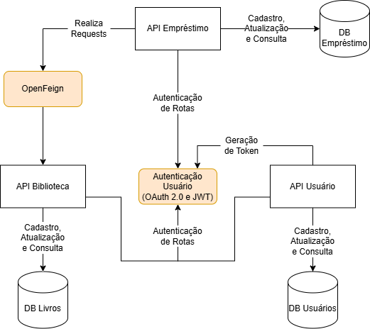

# Serviço de Gerenciamento de Bibliotecas

## Autores
- **Guilherme Marcello Casagranda**  
- **Milena Risso Zanotelli**

---

## Descrição do Projeto
Este projeto é um **serviço de gerenciamento de bibliotecas** que opera com base em **arquitetura de microsserviços**, permitindo o gerenciamento eficiente de:  
- Usuários,  
- Acervo de Livros,  
- Empréstimos e reservas.

O sistema é dividido em três APIs principais:  
- `api-usuario`  
- `api-biblioteca`  
- `api-emprestimo`  

O sistema conta com um gateway (localhost:8083)

Cada API é responsável por funcionalidades específicas, detalhadas abaixo.

---

## Microsserviços e Funcionalidades

### 1. **API Usuário** `/usuarios`
Permite que os usuários da biblioteca realizem:  
- Cadastro no sistema;  
- Login no sistema;
- Atualização de cadastro;
- Consulta de dados cadastrados.

Também permite que o **Administrador** realize:
- Consulta de todos os cadastros;
- Consulta de usuário por Id;
- Deleção de usuário.

É responsável por gerar um token de acesso que controla o acesso às rotas de usuário e administrador.

#### Modelos
- Usuário:
  - id (string),
  - username (string),
  - password (string),
  - fullName (string),
  - List Role (enum: ADMIN, BASIC).

#### Endpoints  
- **POST** `/users` - Cadastra um novo usuário com role = BASIC.  
- **GET** `/users` - Retorna todos os usuários cadastrados (acesso exclusivo do ADMIN, senha criptografada).
- **GET** `/users/{id}` - Busca um usuário pela id fornecida (acesso exclusivo do ADMIN).
- **GET** `/users/profile` - Retorna o perfil do usuário autenticado via token.
- **PUT** `/users/updateProfile` - Atualiza dados cadastrais do usuário autenticado.
- **DELETE** `/users/{id}` - Deleta usuário fornecido (acesso exclusivo do ADMIN).
- **POST** `/login` - Autentica o usuário e retorna um token de acesso.

---

### 2. **Acesso Biblioteca**  `/biblioteca/books`
Responsável pelo acesso e gestão do acervo de livros.  

#### Modelos
- Livro:
  - id (string),
  - title (string),
  - author (string),
  - year (string),
  - isbn (string),
  - totalCopies (int),
  - availableCopies (int),
  - reservedCopies (int).

#### Endpoints  
- **POST** `/` - Cadastra novo livro no acervo (acesso exclusivo do ADMIN).
- **GET** `/` - Retorna todos os livros cadastrados.
- **GET** `/title/{title}` - Busca livro por título.
- **GET** `/author/{author}` - Busca livro por autor.
- **GET** `/isbn/{isbn}` - Busca livro por ISBN.
- **GET** `/id/{id}` - Busca livro por ID.
- **PATCH** `/updateCopies/{id}` - Atualiza o número de cópias totais de um livro (apenas ADMIN).
- **POST** `/updateCopies/loan/{id}` - Atualiza o número de cópias disponíveis de um livro no caso de um empréstimo realizado (apenas ADMIN).
- **POST** `/updateCopies/return/{id}` - Atualiza o número de cópias disponíveis de um livro no caso de uma devolução (apenas ADMIN).
- **DELETE** `/{id}` - Deleta um livro pela sua ID (apenas ADMIN).  
- **PUT** `/{id}` - Atualiza os dados de um livro pela sua ID (apenas ADMIN).
- **POST** `/updateReserved/{id}/{bool}` - Atualiza cópias reservadas de um livro, aumenta ou diminui com base no boolean (autenticação de usuário BASIC).

---

### 3. **Empréstimo**  `/emprestimo`
Gerencia a lógica de reservas, empréstimos e devoluções.  

#### Modelos

- Empréstimo:
  - id (string),
  - idUsuario (string),
  - idLivro (string),
  - dataEmprestimo (LocalDate),
  - dataDevolucaoEsperada (LocalDate),
  - dataRealDevolucao (LocalDate),
  - emprestimoAtivo (boolean),
  - atrasado (boolean).


- Reserva:
   - id (string),
   - idUsuario (string),
   - idLivro (string),
   - dataEmprestimo (LocalDate),
   - dataDevolucaoEsperada (LocalDate),
   - active (boolean),

#### Endpoints  
- **POST** `/loan/` - Realiza um empréstimo (apenas ADMIN).  
- **GET** `/loan/` - Retorna todos os empréstimos (apenas ADMIN).
- **GET** `/loan/{id}` - Retorna um empréstimo pela ID (apenas ADMIN).
- **DELETE** `/loan/{id}` - Deleta um empréstimo pela ID (apenas ADMIN).
- **POST** `/loan/return/{id}` - Realiza a devolução de um empréstimo (apenas ADMIN).
- **GET** `/loan/user/history` - Retorna o histórico de empréstimos de um usuário autenticado.
- **GET** `/loan/user/active` - Retorna os empréstimos ativos de um usuário autenticado.
- **GET** `/loan/active` - Retorna todos os empréstimos ativos (apenas ADMIN).
- **POST** `/loan/updateAtraso` - Verifica todos os empréstimos ativos e muda o boolean 'atrasado' para true.
- **POST** `/reservation/` - Realiza uma nova reserva (usuário BASIC autenticado).
- **GET** `/reservation/` - Retorna todas as reservas (apenas ADMIN).
- **GET** `/reservation/{id}` - Retorna uma reserva pela sua ID (apenas ADMIN).
- **DELETE** `/reservation/{id}` - Deleta uma reserva pela sua ID (apenas ADMIN).
- **GET** `/reservation/myreservations` - Retorna as reservas ativas de um usuário autenticado.
- **POST** `/reservation/inactivateReservations` - Desativa reservas que passaram do prazo de retirada (dataEmprestimo).


---

## Tecnologias Utilizadas
- **Linguagem:** Java com SpringBoot  
- **Banco de Dados:** MongoDB  
- **Arquitetura:** Microsserviços com integração entre APIs REST
- **Autenticação:** OAuth 2.0 e JWT
- **Mensageria:** OpenFeign

---
## Arquitetura

---
## Instruções de Uso

### 1. **Instalação e Configuração**
1. Clone o repositório:  
   ```bash
   git clone https://github.com/gcasagranda/MicrosservicosBiblioteca
2. Configure as variáveis de ambiente se necessário
3. Execute cada microsserviço individualmente
4. Execute o gateway
